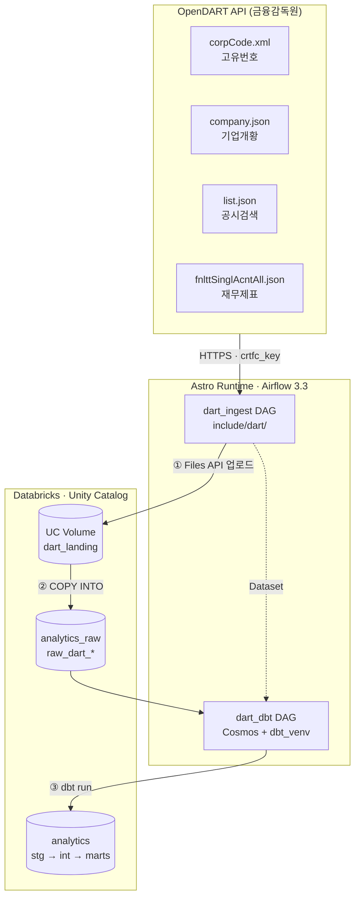

# airflow_dbt — DART 공시 데이터 파이프라인

금융감독원 **[OpenDART](https://opendart.fss.or.kr/)** 공시 API에서 데이터를 수집해 Databricks에 적재하고, **dbt로 분석용 데이터 모델을 구축**하는 프로젝트입니다.

Airflow가 수집(EL)을, dbt가 변환(T)을 담당하며 [Astronomer Cosmos](https://astronomer.github.io/astronomer-cosmos/)가 dbt 모델 1개를 Airflow Task 1개로 자동 변환합니다.

> 설치·설정, 설계 근거, 트러블슈팅은 **[docs/SETUP.md](docs/SETUP.md)** 를 참고하세요.

---

## 아키텍처

<!-- 원본: docs/architecture.mmd -->


| 단계 | 하는 일 | 담당 |
|---|---|---|
| ① 추출 | DART API 호출 → JSON을 Volume에 업로드 | `include/dart/client.py` |
| ② 적재 | `COPY INTO` 로 Volume 파일을 Delta 테이블에 적재 | `include/dart/loader.py` |
| ③ 변환 | raw → staging → intermediate → marts | `include/dbt/dart/` |

**원본 파일을 Volume에 남기는 이유** — 파싱 로직이 바뀌어도 API 재호출 없이 재처리할 수 있습니다. 일일 한도가 있는 API에서 중요한 안전장치입니다.

---

## 구현 현황

| # | 단계 | 상태 |
|---|---|---|
| 1 | `requests` 추가 · DAG 경로 환경변수화 | ✅ |
| 2 | Airflow Connection `dart_api` 등록 | ✅ |
| 3 | `include/dart/client.py` — API 클라이언트 | 🚧 |
| 4 | `corpCode.xml` 수집 → 대상 종목 목록 확보 | ⬜ |
| 5 | `include/dart/loader.py` — Volume 업로드 + COPY INTO | ⬜ |
| 6 | Databricks raw 테이블 DDL | ⬜ |
| 7~9 | 공시검색 / 기업개황 / 재무제표 수집 태스크 | ⬜ |
| 10 | `dags/dart_ingest.py` 조립 + Dataset 발행 | ⬜ |
| 11~15 | dbt 프로젝트 · staging · marts · 테스트 | ⬜ |
| 16~17 | `dags/dart_dbt.py` + 초기 백필 | ⬜ |

---

## 수집 범위

| 항목 | 결정 | 근거 |
|---|---|---|
| 적재 방식 | Volume + COPY INTO | 원본 보존, 대량 처리에 유리 |
| 대상 종목 | 관심 종목 50~100개 | `target_corps.csv` 로 관리, 확장 용이 |
| 재무제표 기간 | 최근 1년 | 파이프라인 검증 우선 |

이 설정에서 **일일 API 호출은 약 500건 / 20,000건(2.5%)** 입니다.

| 호출 대상 | 건수 |
|---|---|
| `corpCode.xml` | 1 (주 1회면 충분) |
| `company.json` × 100종목 | 100 |
| `list.json` (일자 전체, 페이징 포함) | 5~10 |
| `fnlttSinglAcntAll.json` 100종목 × 4개 보고서 | 400 (분기 단위) |

---

## 모델 매핑

| OpenDART API | raw 테이블 | staging 모델 | 성격 |
|---|---|---|---|
| `corpCode.xml` (고유번호) | `raw_dart_corp_code` | `stg_dart__corp_code` | 전체 스냅샷 |
| `company.json` (기업개황) | `raw_dart_company` | `stg_dart__company` | 스냅샷 |
| `list.json` (공시검색) | `raw_dart_disclosure` | `stg_dart__disclosure` | 일자 증분 |
| `fnlttSinglAcntAll.json` (재무제표) | `raw_dart_fin_stmt` | `stg_dart__fin_stmt` | 연도·보고서 증분 |

```
staging/                        intermediate/                    marts/
  stg_dart__corp_code  ──┐                                        dim_corp
  stg_dart__company    ──┼──▶ int_disclosure_categorized  ──┬──▶  fct_disclosure
  stg_dart__disclosure ──┤                                  │     fct_financial_statement
  stg_dart__fin_stmt   ──┴──▶ int_fin_stmt_pivoted        ──┴──▶  mart_corp_financial_summary
```

> ⚠️ 모든 API가 **8자리 `corp_code`(DART 고유번호)** 를 요구합니다. 6자리 종목코드로는 조회되지 않으므로, `corpCode.xml` 수집이 다른 모든 수집의 선행 조건입니다.

---

## 프로젝트 구조

```
airflow_dbt/
├── Dockerfile                      # Astro Runtime 이미지 + dbt 전용 venv
├── requirements.txt                # Cosmos, Databricks provider, requests
├── .env                            # Connection 정의 (Git 제외)
│
├── docs/
│   ├── architecture.mmd            # 아키텍처 다이어그램 원본
│   └── SETUP.md                    # 설정 · 설계 노트 · 트러블슈팅
│
├── dags/
│   ├── jaffle_shop_databricks.py   # 참조용 예제 DAG
│   ├── dart_ingest.py              # 예정 — DART 수집 DAG
│   └── dart_dbt.py                 # 예정 — Cosmos DbtDag
│
├── include/
│   ├── dart/                       # ★ Python 수집 로직
│   │   ├── client.py               # OpenDART API 클라이언트
│   │   ├── endpoints.py            # 예정 — 엔드포인트별 파라미터 정의
│   │   └── loader.py               # 예정 — Volume 업로드 + COPY INTO
│   │
│   └── dbt/                        # ★ dbt 프로젝트 전용 (Python 파일 금지)
│       ├── jaffle_shop/            # 참조용 예제 dbt 프로젝트
│       └── dart/                   # 예정 — DART dbt 프로젝트
│           ├── dbt_project.yml
│           ├── seeds/target_corps.csv   # 대상 종목 목록 (수집·dbt 공용)
│           └── models/
│               ├── staging/
│               ├── intermediate/
│               └── marts/
│
└── tests/dags/                     # DAG 무결성 테스트
```

> **`include/dart/` 와 `include/dbt/dart/` 를 혼동하지 마세요.** 앞은 Python 수집 코드, 뒤는 dbt 프로젝트입니다. `include/dbt/` 아래에 Python 파일을 두면 dbt 실행 시 뒤섞입니다.

**`target_corps.csv` 가 단일 소스** — 수집 로직과 dbt seed가 같은 파일을 참조하므로, 종목 추가/제거가 이 파일 수정 한 번으로 끝납니다.
